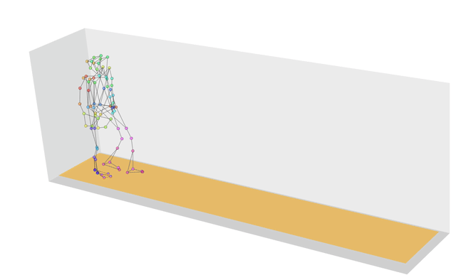
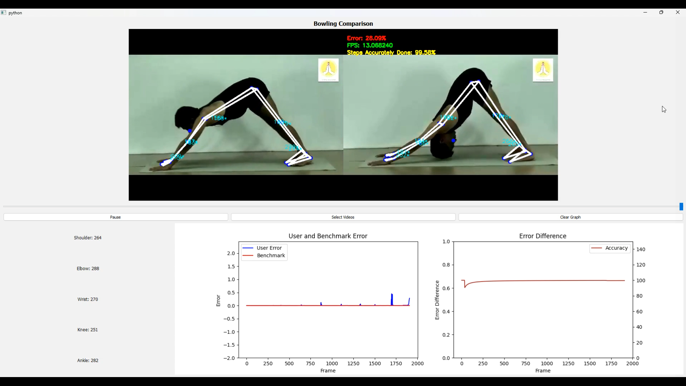

# Body Movement Comparison with Mediapipe

This project is a PyQt5-based application that utilizes pose estimation powered by MediaPipe along with the DTW (Dynamic Time Warping) algorithm to compare pose sequences from two video inputs. The tool identifies and visualizes differences in movement patterns, specifically designed to analyze cricket bowling before and after injuries, as well as yoga performances over time.



## Features

- **Pose Estimation:** Leveraging MediaPipe to capture key pose landmarks from video inputs.
- **DTW Algorithm:** Dynamic Time Warping algorithm is used to compare the temporal alignment of poses between two videos.
- **Injury Analysis:** Compare cricket bowling movements before and after an injury, detecting discrepancies and deviations.
- **Yoga Progress Analysis:** Analyze changes in yoga poses over time to monitor performance improvements or degradations.
- **Graphical Report:** Provides a visual comparison with graphs indicating the variation in poses across the two inputs.
- **PyQt5 Interface:** User-friendly interface built using PyQt5 for easy video input, analysis, and report generation.

## Installation

To set up the project on your local machine:

1. Clone the repository:
   ```bash
   git clone https://github.com/subhashbs36/Body-posture-comparision-tool-using-pyqt5.git
   ```

2. Navigate to the project directory:
   ```bash
   cd pose-comparison-tool
   ```

3. Install the required dependencies:
   ```bash
   pip install -r requirements.txt
   ```

## Dependencies

- Python 3.8+
- MediaPipe
- PyQt5
- NumPy
- Matplotlib
- DTW library

To install all dependencies, simply run the command below:
```bash
pip install mediapipe PyQt5 numpy matplotlib dtw-python
```

## Usage

1. Launch the application:
   ```bash
   python main.py
   ```

2. Use the interface to upload two videos for comparison:
   - **Bowling Injury Analysis:** Upload pre-injury and post-injury bowling videos.
   - **Yoga Progress Tracking:** Upload earlier and recent yoga performance videos.

3. The tool will run the pose estimation and apply the DTW algorithm to compare the poses frame by frame.

4. A graphical report will be generated showing the differences in pose alignment.

## Example

Here's an example of the graph output after comparing a bowler's action before and after an injury:


Here's an example of the graph output after comparing Yoga actions of two very similaar yoga poses but different in nature:



## Applications

- **Sports Injury Analysis:** Useful for coaches and medical professionals to assess movement differences post-injury.
- **Yoga Progress Tracking:** Yoga practitioners can monitor how their poses evolve over time and improve performance.
- **General Pose Comparison:** Can be applied in various other fields where pose and movement analysis is required.

## Future Enhancements

- Adding support for additional sports and movements.
- Enhancing the accuracy of pose comparison with more advanced algorithms.
- Integration with cloud-based video storage and analysis.
- Providing detailed textual feedback alongside graphical reports.

## Contributing

Contributions are welcome! Please feel free to submit issues, fork the repository, and send pull requests.

## License

This project is licensed under the MIT License. See the [LICENSE](LICENSE) file for details.
